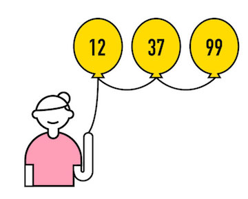
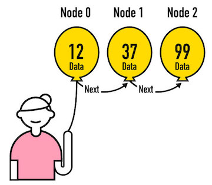
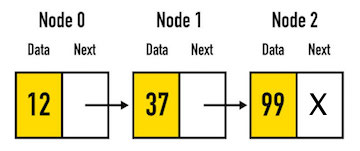

# Intro to Linked Lists
Earlier we said it's possible for one **Abstract Data Structure** to have more
than one implementation. It's true! We've seen the **List ADT** which says
something is a list if it supports operations according to List specification.
We implemented our own `List` class satisfying the **List ADT** using an array
internally. Now we'll do something different.

# What Are Linked Lists?
A **Linked List** is an implementation of the **List ADT** that uses pointers
instead of arrays. A pointer in programming is just a reference from one
variable to an on object. It's possible to build List-like structure by linking
objects together.

## A Balloon Analogy
Imagine holding a lot of balloons with numbers written on them. It's easy to
hold on to all the balloons in a big handful, but that doesn't really impose
any order on the collection. If you want to order the balloons, which is the
first in a handful?

You can impose an order on your collection of balloons by tying them end to
end and allowing them to float up into the air. Now you're only holding on to
one balloon string, the second balloon is tied to the first balloon, and so on.
Now you have a list made of balloons! This is a linked list - each balloon is
tied (linked!) to the ones next to it.



# List Nodes
As much as we'd like computers to have balloons, a **Linked List** does not have them. Instead, every element in a **Linked Lists** is built out of a **Node** object. (No, this
name has nothing to do with the NodeJS server environment. It's just the
terminology for Linked Lists, which came first! It's like a node in a network.)
A **Node** or a **List Node** is a simple object that has two properties:

* `data` - the value of data this node holds
* `next` - a reference to the next node in the list, or `undefined` if it is the last node

In the balloon analogy, nodes are balloons. The number written on the balloon
is the value of the `data`. A string running from one balloon to the next
balloon represents the `next` property. A balloon at the end of the list
without a string to another balloon has a value of `undefined` for its `next`
property.




We draw Linked Lists like this. Each node is a rectangle. There's a node with an X at the end of the list
to represent that the last node in the list doesn't point to anything - it's the end of the list.



Conversely, in an array we'd have
`[12, 37, 99]`.

The linked list is clearly not an array, yet the nodes in the linked list still maintain their order in a
List-like fashion.


## Linked Lists in JavaScript


Here's a small sample of how we achieve the "balloon tying" effect in
JavaScript.

* First, we make three node objects, each with a `data` variable and a `next` variable.
* We can assign `data` to the value we want the node to hold.

```js
// make three nodes for each thing in the list.
var n0 = {data: 12, next: undefined};
var n1 = {data: 37, next: undefined};
var n2 = {data: 99, next: undefined};
```

> Linked Lists are indexed just like arrays. They're `zero-indexed`. Just like the balloons above, the
first thing in the list is considered to be at index zero.

* Then, we "tie" the nodes together by setting `next` for nodes 0 and 1 to the next node.

```js
// have the first node point to the second node.
n0.next = n1;

// have the second node point to the third node
n1.next = n2;
```
* To check, we can log it to the console. We simply start at the first `node` object, log the `data` in it to the console, and then use `next` to get to the subsequent `node` object.

```js
// now you can access the data at each of the nodes by starting at the first
// node, and seeing the `next` node after that, and the `next` after that
// through the `.next` properties.
console.log(n0.data);             // 12
console.log(n0.next.data);        // 37
console.log(n0.next.next.data);   // 99
```


> [Check it out in this JSBin - can you add another node and log it to the console?](https://jsbin.com/fevecey/edit?js,console)


# Why Linked Lists?

As you're about to see, we can still add and remove values (`node`s) in the list and read and overwrite values at indexes inside the list. The
**Linked List** fits everything in the **List ADT** specification; it's just
a different implementation than the array list we just saw.

Implementing a **List** as a **Linked List** with nodes offers some advantages
over implementing a list out of an Array. Remember how removing items in an
array left gaps? Remember how we had to shift every element over in an
`ArrayList` in order to make room for a new item? Those problems totally go
away with **Linked Lists**. Instead of items in the list occupying positions
at fixed positions in an array, the items only keep reference to each other
through points. It's like one long rope tied to different balloons. You can
follow the rope and find everything in the list. If you remove a balloon
from the rope it's simply gone from the rest of the list, without having to
untie everything else and scoot it over.

Linked Lists are an excellent data structure to choose when you need to
insert or remove things from the middle of a long list often.
