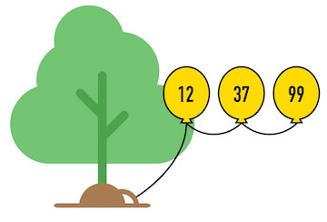

## List Specification
This is the exact same specification we've already seen - it's here again for your reference while we start to implement it using Linked Lists!

<table>
  <tr>
    <th>Return type</th>
    <th>Operation</th>
    <th>Description</th>
  </tr>
  <tr>
    <td>List</td>
    <td>`new List()`</td>
    <td>Create a new empty list</td>
  </tr>
  <tr>
    <td></td>
    <td>`append(item)`</td>
    <td>Adds an item at the end of the list</td>
  </tr>
  <tr>
    <td>item</td>
    <td>`get(index)`</td>
    <td>Returns the item at the index in the list.</td>
  </tr>
  <tr>
    <td></td>
    <td>`set(i, item)`</td>
    <td>Overwrites the list at the index with value.</td>
  </tr>
  <tr>
    <td></td>
    <td>`insert(index, item)`</td>
    <td>
      Inserts the item at the index, shifting all existing elements up by one
      index to make room.
    </td>
  </tr>
  <tr>
    <td>item</td>
    <td>`remove(index)`</td>
    <td>
      Removes and returns the item at the index in the list, shifting all
      elements after the index down by one to fill the now empty position.
    </td>
  </tr>
  <tr>
    <td>int</td>
    <td>`size()`</td>
    <td>Returns the number of items in the list.</td>
  </tr>
  <tr>
    <td>boolean</td>
    <td>`isEmpty()`</td>
    <td>Returns true if the list is empty.</td>
  </tr>
  <tr>
    <td>List</td>
    <td>`copy()`</td>
    <td>
      Returns a new independent duplicate copy of the current list.
    </td>
  </tr>
</table>

## Back to Balloons
Take time to consider how you would manage handling a list created out of
balloons. How would you add some balloons? Remove some balloons? Rearrange some balloons? Adding, removing and rearranging are all part of
the **List ADT**. We'll need to figure out how to do these things with our
balloon list.

But - careful! When you're trying to add or remove balloons you should make sure
you don't lose track of any and allow some to float away into the air
unintentionally! (It's ok to let balloons you're specifically removing be cut
away and float off into the air... but maybe not the rest of them!)

To make things a little easier on yourself, you can imagine that the very first
balloon is tied to a `root` on the ground so you can comfortably use both your
hands while you manipulate the rest of the balloons.
You can trust the `root`; you know the whole list of balloons won't
just float away no matter what you do - as long as the first one in the list is tied to the `root`!

For a thought exercise, take a few minutes to hypothesize, given that linked list of balloons, how you would do each of the operations below. We'll go over it in a minute, but come up with a thought first!

So if you have a collection of balloons tied end to end and the first was tied to a tree root...

### Searching
* ...how can you find out if you have a certain number written on a balloon in the
  chain? Let's say you're not allowed to just look up. You can only see the number on whichever balloon is currently in your hand right in front of your face.

### Indexing
* ...how can you find out what number is written on the first balloon?
* How can you find out the number on the tenth balloon?
* How can you find the number on the last balloon?

### Inserting
* How would you add a new balloon at the end of the chain?
* How would you add a new balloon so it's the first one in your hand?
* How would you add a new balloon at an exact location somewhere in the middle
  of a chain?

### Removing
* How would you get rid of just the first balloon in the chain?
* How would you get rid of the last balloon in the chain?
* How would you get rid of a balloon at an exact location in the middle of
  the chain?
