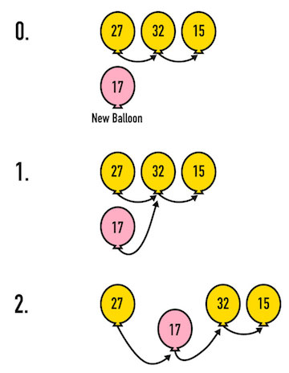

## Balloon Handling Techniques
Once you have an idea for each of those questions, let's see how it compares. If you need to, feel free to read about one operation and revise your hypothesis for the rest!

Here are some tips on how to handle a Linked List of balloons. These techniques
are designed to make sure you don't make a mistake and accidentally let go of
the whole list of balloons you're trying to keep track of.

## Searching
> *...how can you find out if you have a certain number written on a balloon in the
  chain?*


**In balloon terms..**

You have to look at the balloons one by one, following the string on each balloon to the next one.

* Bring down the first ballon and
look at it. Is it the number you're looking for? Great! You're done!
* If you're looking for a number that's not on the first balloon, you're going to
need to look at the next balloon. See if the first balloon has a second balloon tied to it.
* Follow the
string tied from the first balloon to the second balloon.
* Look at the second
balloon. Does it have the number you're looking for? Great! You're done!
* You can continue to search through the balloons using this technique.

** In computer science terms...**

You have to look at the `node`s `data` one by one, following the `next` pointer on each `node` to the next one.

Our balloons represent the `node`s. The number written on the balloon is the `node`'s `data`. You can only look at one balloon at a time, and the `node` you are looking at is the `current node`.

* Look at the `data` value of your `current` balloon. Check its `data` to see if
it contains the value you're looking for.
* If not, move on to the `next` balloon by
following the rope tied from your `current` balloon to the `next` balloon.
* Make
that `next` balloon your `current` balloon.
* Repeat until you find it!

If you're ever searching through a list and one balloon doesn't have another
balloon tied to it, then you know you've reached the end of the list. If you didn't find the value you were searching for, it isn't in the list.

In order to start another search, you simply have to start the process over again
starting from the balloon that's tied to the `root` on the ground.

## Indexing

> *...how can you find out what number is written on the first balloon?*


** In balloon terms...**

Finding the value of the first balloon is easy. Go to the tree root and see what
balloon is tied to it.

** In computer science terms...**

See what the `data` in the first `node` (the one attached to `root`) is.


> *...how can you find out the number on the tenth balloon?*

** In balloon terms...**

If you ever want to find the value of a balloon at a specific index, you'll need
to follow each tied
balloon and count while you do it.
* The first balloon is at index `0` because
you had to count past `zero` balloons to get there.
* The second balloon is at
position `1` because you had to pull down past one balloon to get there.

To find a balloon at a specific index you must pull each balloon down one by
one and keep track of how many balloons you've pulled down along the way.
* If
you reach the number you're looking for (like the 10th balloon), you can then read the value off the balloon.

** In computer science terms...**

* Follow the `next` pointer of your `current node`, which is the `node` attached to `root` (so it's index `0`).
* Then you'll have a new `current node`, so follow its `next` pointer.
* Repeat - follow each `next` to grab a new `current` node.
* If
you reach the number you're looking for (like the 10th `node`), you can then read the `data` in the `node`.


> *...how can you find the number on the last balloon?*

** In balloon terms...**

To find the last balloon in the list, you can skip counting numbers and just
pull down the balloons until you find one that doesn't have another balloon tied
to it. That's the last balloon in the list.

** In computer science terms...**

Again, you don't need to count. Follow the `next` pointer on each node until you get to a node that doesn't have a valid pointer for `next` - that's the last node.


## Inserting
> * *How would you add a new balloon at the end of the chain?*
> * *How would you add a new balloon so it's the first one in your hand?*
> * *How would you add a new balloon at an exact location somewhere in the middle
  of a chain?*

Whenever you're manipulating what's in the chain of balloons you need to be extra careful to make sure you don't break the chain of balloons and let some float away! In general, you tie the new balloon to the balloon that
will come after it, then, holding on to the new balloon, attach that to the previous one.


**In balloon terms**

0. Have a new balloon! (I like yellow ones)
1. Tie new balloon to what will be its next one (so now the next balloon has two strings!)
2. Untie the string connecting the previous balloon to what was its next, and instead tie it to the new balloon.


Here's that in image form:



**In computer science terms**

0. Have a new `node` object with `.data` in it
1. Point the `.next` of the new `node` to what will be the following node after it's inserted
2. Point the `.next` of the previous `node` to this new `node`


Here's that in image form:


Let's talk specifically about each case:

#### Inserting at the End:

**In balloon terms**

Adding a balloon to the end of the balloon chain is straightforward.
* Follow the string through all of the balloons until you reach the
last balloon.
* Tie the new balloon to the last balloon.

**In computer science terms**
* Follow the `.next` chain of `node`s until you reach the end `node`, which will have `.next` as undefined.
* Set the `.next` of the end `node` to point to the new `node`


### Inserting in Front:

**In balloon terms**
* Tie your new balloon to the first balloon.
* Untie what was the first balloon from the root.
* Tie your new ballon to the root

**In computer science terms**
* Set the `.next` of the new `node` to point to the first `.node`
* Set the `.root` to point to the new `node`


#### Code Along: Inserting New Items in the List
Let's add `42` to the front of a linked list. Linked lists don't usually expose each node
as a variable like above with `n0`, `n1` and `n2`. You usually only have access
to `root` and you must derive all of your interactions from there.

##### Balloon Dropping (Losing References to Nodes)
As imagined, if you don't connect things in the proper order, then you'll lose reference to
nodes in the list. Here, the new node was created and defined as the first thing
in the list too early. We overwrote the value of `root` to make the new node
the first thing in the list, but in doing so first, we lost reference to all other nodes in the list
in the process. Or more simply - we untied the first balloon from the root and tied the new balloon to it instead - but all the other balloons floated away when we untied the first one!

> So this code is code you should *NOT* use. It's the wrong way - losing balloons!

```js
// The wrong way - losing balloons!

// First, let's make our linked list
var root = new ListNode(0, new ListNode(1, new ListNode(2)));

var node = new ListNode(42);   // create the new node.
root = node;                   // make the node the first thing in the list - tie it to the root
node.next = ???                // oops. The rest of the list floated away - because we access everything from root, we can no longer access root.next to get the second balloon!
```

In order to keep our references to everything, we need to set the `next` value
of the new node to point to the front of the list, then reassign the value of
`root` to the new node.


```js
// create the list
var root = new ListNode(0, new ListNode(1, new ListNode(2)));

var node = new ListNode(42);  // create the new node with 42 as data
node.next = root;             // point `next` to the front of the list.
root = node;                  // make `root` point to the new node.
```
> [Try it the right way!](http://jsbin.com/qewofiz/edit?js,console)


### Inserting in the Middle:

**In balloon terms**

* Follow the balloon string, counting through the list until you find the position
where you want the new balloon
* Tie a rope between your new balloon and the balloon that
will come after it.
* Now untie the balloon after it from the balloon before it.
* Tie the new balloon to the balloon just before it.

## Removing
> * *How would you get rid of just the first balloon in the chain?*
> * *How would you get rid of the last balloon in the chain?*
> * *How would you get rid of a balloon at an exact location in the middle of
  the chain?*

Removing and inserting things in the chain of balloons is slightly harder than
simply searching through the balloons for a value or adding a balloon. When you're manipulating what's in the chain of
balloons, you need to be extra careful to make sure you don't break the chain of
balloons and let some float away. You'll probably need an extra `temp` hand for some of them to
hold on to something!

### First Balloon:

**In balloon terms**
If you want to take the first balloon out of the chain
simply untie it from the `root` and let it go. But, wait! Oh no, all of the
other balloons just floated away when you untied that first one. Oops.

* It's a good best practice to tie the second balloon to the root first.
* Now it's ok for the first balloon to be untied and
float away all by itself.

**In computer science terms**

The same idea - we can't just lose `root`! But this is actually a little easier in the list than with the balloons, because both untying the first balloon and tying the second to the root happen in the same step.

* Assign `.root` to the second `node`: simply `root = root.next`

#### Code Along: Removing Nodes
Remove the first node by setting the value of `root` equal to what that first
node's `next` value was pointing to. This effectively rewrites `root` to skip
over that first node.

```js
var root = new ListNode(0, new ListNode(1, new ListNode(2)));
root = root.next;
```
> [Try it!](http://jsbin.com/purubox/edit?js,console)

### Last balloon:
**In balloon terms**

If you want to remove the last balloon, you're in luck. It's
easy!

* Pull down the balloons one by one until you find the last balloon that
doesn't have anything tied to it.
* Untie that balloon off and let it float away.

Consider where you untied that last balloon. Did you untie the string from the
last balloon, so the last balloon floated away with no string on it and the
string stayed dangling on what was the second-to-last balloon?

It's best to actually stop one balloon before you get to the end of the chain.
This way you can untie the last balloon string from the second-to-last balloon
and the new last balloon won't have any string left dangling.

But - we can only follow arrows one way! When you find the last balloon, you can't go backwards to look at the balloon before it. (note: There are linked lists that you can traverse both ways - these are called **Doubly linked lists**, and we aren't going to go into them). Because of this, you actually needed to hold on to two balloons at once - the balloon you want to untie, and the balloon before it where you will actually untie the string.

**In computer science terms**
* Create a `previous` variable. Set `previous` to be the root `node`
* Follow the chain of `.next` on each `node` object
  * Each time you move on the chain, set the `previous` object to the previous `node`
* Continue until you reach the `node` where `.next` is `undefined`
* At this point, the `previous` object should be the second to last `node`
* In the `previous` `node` (which is the second to last), set `.next` to undefined.


# Iterating Through Linked Lists
Before we make anything more complicated we'll have to learn how to iterate
over a Linked List. Iterating through arrays is easy because we can use a
`for` loop to count from `0` up to the `.length` of the array and access `a[i]`
along the way.

In order to iterate through a Linked List, we need to follow our balloon strategy
and grab the `ListNodes` one `current` balloon at a time and see if they have
another string tied to them, a `next` property that's not undefined.

Here's the basic idea:

* Create a local variable named `current` and point it to `root`.
* Create a `while` loop that runs while `current != null`.
* Step through the list by setting `current = current.next` in the `while` loop.

Here's how to iterate through every element in a Linked List and print out
each nodes data. Notice how `current` starts at the first node and just steps
forward through the list one by one. If it ever gets set to a `.next` value
that was `undefined` then the while loop just stops.

```js
var root = new ListNode(0, new ListNode(1, new ListNode(2, new ListNode(3))));
var current = root;
while (current !== undefined) {
  console.log(current.data);
  current = current.next;
}
```

#### Codealong: Last balloon
If you know how many items the list has, this is very straightforward - Remove the last node of a three node list by rewriting the value of the second node to `undefined`.

* `root.next` is the second node.
* `root.next.next` is what the second node points to.

[Try it!](http://jsbin.com/fudamoj/edit?js,console)
```js
var root = new ListNode(0, new ListNode(1, new ListNode(2)));
root.next.next = undefined;
```

However, when you don't know how many items the list contains, you'll need to use `temp` or just track a `previous` node. What if we only know the data for the node we want to delete?

```js
var previousNode = root; // keep track of the previous
var currentNode = previousNode.next; // keep track of the node you're on!
while (currentNode !== undefined) {
    if (currentNode.data === val) { // if the data is right
        previousNode.next = currentNode.next; // set the previous node to the .next of the current - effectively skipping, or deleting, the current
        currentNode = currentNode.next;
        break; // stop the while loop - we're done!
    } else { // otherwise, keep moving forward through the list
        previousNode = currentNode;
        currentNode = currentNode.next;
    }
}
```

[Try it!](http://jsbin.com/qavuheq/1/edit?js,console)

### Middle Balloon:

Removing the last balloon is easy, because you don't have to
worry about anything tied after it floating away. Removing the first balloon
isn't too bad because you're close to the `root`, where you can easily skip over
the first balloon and just tied the second balloon straight to the `root`.

Removing middle balloons is a bit harder, because you're going to have to keep two
balloons in your hand at once. Here are steps to follow if you're trying to remove
the fifth balloon in a long chain of balloons:

**In balloon terms**
* Find the fourth balloon: Start at the root, find the first balloon and start counting at 0
* Grab the fifth balloon, and grab the sixth balloon too.
* Tie a string from the fourth balloon to the sixth balloon
* Untie the string between the fourth balloon and what was the fifth balloon.

**In computer science terms**
Very similar to removing the last balloon
* Find the fourth `node`: Start at the root and follow the `.next` to the fourth `node`.
* Set the fourth `node`'s `.next` to `.next.next` - effectively skipping the 5th balloon.

#### Codealong: Removing the second node
Remove the second value by having the `next` value of the first node point
to the third node instead of the second.

* `root` is the first node.
* `root.next` is what the first node points to.
* `root.next.next` is the third node.


[Try it!](http://jsbin.com/qevuteh/edit?js,console)
```js
var root = new ListNode(0, new ListNode(1, new ListNode(2)));
root.next = root.next.next;
```

You can see here that when you remove balloons, or **nodes** in a
**Linked List** you don't have to shift everything around like you do in an
array.
