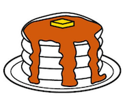
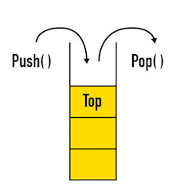
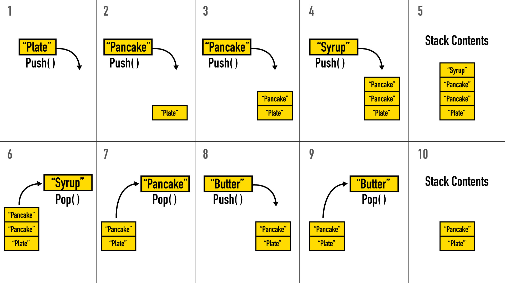

Stacks
============================================

---

## Why is this important?
<!-- framing the "why" in big-picture/real world examples -->

As you're seeing, there are a handful of common ways we want to organize data. Sometimes we want data to be easily accessible no matter what index or key it lives at (array or object). Sometimes we want data to be organized in such a way that it is easy for the computer to store it without making a lot of space available ahead of time (linked list). In the case of stacks, we want to maximize the efficiency of adding an element to the one end and returning an element from that same end.

## Learning Objectives
<!-- specific/measurable goal for students to achieve -->
*After this, you will be able to:*

- Describe a stack by its methods.
- Articulate last-in first-out (LIFO) behavior.
- Build stack methods using list methods.

---

## What is a Stack?

Stacks as a data structure are a lot like stacks as a physical structure. Think of stacks of dishes, books, or pancakes.

We can remove an item from the top of the stack or add an item to the top of the stack. In a stack of pancakes, you can't get to the middle or bottom ones - you can only add hot pancakes to the top of the stack and remove the top pancake from the stack to your plate.

The same way, this data structure only allows us to manipulate the top item of the stack. Stacks are "Last In, First Out" -- the last item pushed on top of a stack will be the first thing popped off of the stack (good luck getting the bottom pancake or one from the middle!).

The two main methods used in stacks are `push` and `pop`. `Push`, as it sounds, puts an object on `top` of the stack (you might make a new pancake; it'll get `push`ed on `top` of the stack already there). `Pop`, as it sounds, pops the `top` object off the stack (you decided to start eating the pancakes and popped the `top` one off the stack and onto your plate).

Stacks are referred to with "**last in, first out**", or "**LIFO**". The last item to be `push`ed is the first item `pop`ped out. The last pancake made is at the top of the stack, so it's the first pancake to be eaten!

Like lists, arrays, and the other data structures, you can hold any type of object in a stack.

Let's walk through an example:

----------------------------

## Thinking with Stacks

Take some time to think about these questions.

1. What are some real life structures or objects that a stack could simulate well?
2. Draw a stack after each of the following operations:

  * PUSH "Beach"
  * POP
  * PUSH 814
  * PUSH 41
  * PUSH "Apple"
  * POP
  * PUSH 8

  

  
click for answer

    `[]` --> PUSH "Beach" --> `["Beach"]` --> POP --> `[]` --> PUSH 814 --> `[814]` --> PUSH 41 --> `[814, 41]` --> PUSH "Apple" --> `[814, 41, "Apple"]` --> POP --> `[814, 41]` --> PUSH 8 --> `[814, 41, 8]`

  

3. Stacks are often implemented with linked lists. Think about how you'd use a linked list to make a stack.  Where will you put the "top" of the stack? How would you add something to the top the stack? How would you take something off?

 

 
Stuck? click for an answer...

 *The "top" could be the head of the linked list. To `push` something on to the top, you could use `prepend`. To `pop`, you could `delete` the list's head and return it.*
 

4. It's also pretty natural to use arrays for stacks given the built-in methods we have access to in JavaScript.  So, let's think of arrays.  Where would you put the "top" of the stack? How would you add something to the top the stack? How would you take something off?

 

super stuck? click for an answer...

 *The "top" could be the end of the array, and you could use array methods `push` and `pop`.  Thanks, JavaScript! We'll do this next!*
 

