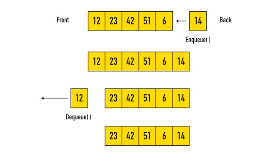

Queues
---

## Why is this important?
<!-- framing the "why" in big-picture/real world examples -->

A queue is built to simulate any situation where people, tasks, or items get in a line and are addressed one by one in the order they arrived. Items are addressed in a first in, first out basis. This is important because it's extremely common in the real world.

## Learning Objectives
<!-- specific/measurable goal for students to achieve -->
*After this workshop, you will be able to:*

- Describe a queue by its methods.
- Describe a queue's first-in first-out (FIFO) behavior.
- Build queue methods using list methods.

------------------------------------------

## What is a queue?

In the English dictionary, a *queue* means "a line" or "to line up". Think of an orderly line of people waiting to do buy something to eat.

Stacks are often discussed with queues because they're similar - though aren't the same. You can read about queues below, and you can also watch [this video](https://www.youtube.com/watch?v=6QS_Cup1YoI) for comparison.

With the queue abstract data type, we have two functions:
* We can also add an item to the **back** of the queue when it joins the line by `enqueue`ing it.
* We can remove an item from the **front** of the queue by `dequeue`ing it.

### First-In First-Out

Queues are **First In, First Out** _(FIFO)_. This means that items are dequeued in the order in which they are enqueued. The first person in the grocery store line is also the first person out of the grocery store line.

While we may be able to "cut" in line in the real world, the queue data structure only allows us to add to the end of the queue or remove from the beginning.  

Like with stacks, some implementations of queues also allow us to `peek` at the value of the first item without `dequeue`ing it.

---

### Thinking with Queues

Take some time to think about these questions.

1. What are some real life structures and objects that a queue could simulate?

2.  Draw a queue after each of the following operations:

  * ENQUEUE 15
  * DEQUEUE
  * ENQUEUE "Popcorn"
  * ENQUEUE 515
  * ENQUEUE "GA"
  * DEQUEUE
  * ENQUEUE "Smile!"

  

  
click for answer...

    `[]` --> ENQUEUE 15 --> `[15]` --> DEQUEUE --> `[]` --> ENQUEUE "Popcorn" --> `["Popcorn"]` --> ENQUEUE 515 --> `["Popcorn", 515]` --> ENQUEUE "GA" --> `["Popcorn", 515, "GA"]` --> DEQUEUE --> `[515, "GA"]` --> ENQUEUE "Smile!" --> `[515, "GA", "Smile!"]`

  

3. How would you implement a queue **with an array** in JavaScript? Where would you decide the front of the queue would be? How would you `enqueue` something to the end of the queue? How would you `dequeue` something from the front of the queue?

 

super stuck? click for an answer...

 > The "front" could be the beginning of the array.  To enqueue, you'd use JavaScript's handy `push` array method. To dequeue, you could use JavaScript's `shift` method, which removes and returns the first element from an array.
 

4. How would you implement a queue **with a linked list**? Where would you decide the front of the queue would be? How would you `enqueue` something to the end of the queue? How would you `dequeue` something from the front of the queue?

 

super stuck? click for an answer...

 > The "front" could be the head of the linked list. The "back" could be the tail. You could enqueue by `append`ing to the tail. You could dequeue by deleting and returning the head node.
 

---

## Implementing the Queue

Now that we understand the concept behind a queue, let's program it!
