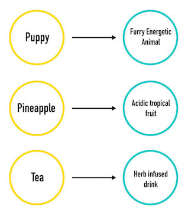
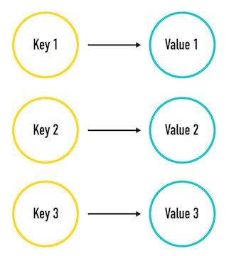

Maps
========================================================

In this section, we will cover one of the most useful data structures: the `Map`.

> Maps are also referred to as a(n):
>
> + Dictionary
> + Associative Array
> + Hash Map
> + Hash Table

## Learning Objectives

<!--By the end of this lesson, Students will be able to -->

+ Articulate what a Map is
+ Articulate the structure of a Map
+ Add a key-value pair
+ Look up a value for a key
+ Remove a key-value pair
+ Iterate through a Map

## Why is this important?

### Utility
A `Map` is by far one of the most commonly used data structures. Maps are extremely versatile and often help turn a difficult problem into a trivial one.

### Real-World
While it may seem purely academic, a `Map`  is frequently used in real-world code. In fact, in JavaScript you already use objects, which are considered a type of a Map.

### Database
A `Map` is the most basic data structure used to represent a Database. This makes it a very commonly used to create in-memory databases, caches, and dictionaries.

---

## What is a Map?

### Definition

> A `Map` is a Set of [key,value] pairs.

What in the world does that mean?

A Map consists of two components, a `key` and a `value`.

Imagine an actual dictionary. You can look up the definition of a word in a dictionary.
The word is the `key` and the definition is the `value`.

#### Key 🔑
The key what is used to unlock the value. For example, this would be the dictionary word you look up.

In a Map, all keys must be unique. For example, imagine you went to look up the word "pineapple" in the dictionary and it was listed three times. Which entry would be the correct one? You wouldn't know.

#### Value 🎁
A `value` is the data associated with a `key`.

The `value` is like the gift you get when you give the Map a `key`.

The value would be the word definition - you find it by looking up the key.

The most important thing to remember about Maps is that **a `Map` is all about *relationships*.**

Each link, or relationship, is known as a key-value pair, hence the definition of a map, *a set of key-value pairs*.

