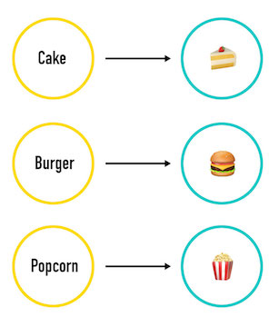

---

## Example
Let's say you wanted to create a Map of Food. It might look something like this:





The key is the name of the food item, and the value is the actual food item (the emoji).
So when you ask the Map to give you a "Burger", it gives you a 🍔.

Let's look at building this.

---

## Creating a Map
Creating a map is simple.
* Assign a variable to `new Map()`

```js
var myMap = new Map();
```
> [Try it!](https://jsbin.com/gecujuzure/edit?js,console) This JSBin has a console.log in it already to follow what you're doing.

---

## Adding key-value pairs
Adding key-value pairs in Javascript is done using the `set()` function.

The first parameter is the `key` and the second is the `value`. It looks like so:

* `myMap.set(key, value);`

> NOTE: "Adding" to a Map is sometimes called "putting"

```js
var bookAuthors = new Map();

bookAuthors.set("The Elegant Universe", "Brian Greene");
bookAuthors.set("The Alchemist", "Paolo Coelho");
```
> [Try it!](https://jsbin.com/cebugocijo/edit?js,console) You'll notice that the console.log has become a little more complicated - we'll discuss this later; it's just to be sure to print the whole map. For now, concentrate on the `.set()`

You can also create a map and set the values at the same time.

This is done by combining the Map declaration and the `.set()` function.
Each new key-value pair goes on a new line. You don't need commas between it.

```js
var bookAuthors = new Map()
                       .set("The Elegant Universe", "Brian Greene")
                       .set("The Alchemist", "Paolo Coelho");
```
> [Try it!](https://jsbin.com/tefatazize/edit?js,console)

### Practice
+ Create a `Map` called `albums` that maps a music album to its artist.
    For example, `"The Black Album" -> "Jay-Z"`

+ Add at least 3 albums.

[Start here!](https://jsbin.com/soluxesoka/2/edit?js,console)

---

## Looking up values
The major advantage to a `Map` is that it allows you to look up values given that you know the key. this is done simply with a `.get()`, passing in the key you'd like. `get` returns the value of that key.
> `Get`ting is sometimes referred to as a "lookup".

Here, we:
* create a map of stock prices, initializing it with values as we create it.
* can call a `.get()` on the key Dell to return the value, which is the stock price of Dell.

```js
var stockPrices = new Map()
                       .set("Dell", 4.3)
                       .set("Apple", 844.0)
                       .set("IBM", 13.22)
                       .set("Google", 923.49);

var dellStockPrice = stockPrices.get("Dell");
console.log(dellStockPrice); // returns 4.3

```
What happens if you look up a key that isn't in the map? `get` will return `undefined`.

```js
var stockPrices = new Map()
                       .set("Dell", 4.3)
                       .set("Apple", 844.0)
                       .set("IBM", 13.22)
                       .set("Google", 923.49);

var dellStockPrice = stockPrices.get("Dell");
console.log(dellStockPrice); // returns 4.3

var amazonStockPrice = stockPrices.get("Amazon"); //Amazon does not exist in the Map
console.log(amazonStockPrice); //Will be undefined

```

[Try it!](https://jsbin.com/dofiluriku/edit?js,console)


### Practice

+ Create a `Map` that functions as an English dictionary, where the key is a word and the value is the word's definition.
+ Add at least 5 key-value pairs
+ Get the value of a word in your dictionary
+ Print the value
+ Try getting the value of a word **not** in your dictionary
+ Print the value

[Start here!](https://jsbin.com/pugexiwade/2/edit?js,console) A method is already created to print the whole map.

---

## Removing a key-value pair

To remove a key-value pair, call the `delete()` function and pass it the key.

Here, we:
* Create a map called "dictionary"
* Initialize it with `key`/`value` pairs of words and definitions
* For practice, do a lookup on the `key`  "Capitol"
* Delete the `key` "Capitol"
* Again, do a lookup on "Capitol" - it isn't there

```js
var dictionary = new Map()
                      .set("kenning", "a conventional poetic phrase")
                      .set("Capitol", "the building in Washington, D.C., used by the Congress of the U.S.")
                      .set("temple", "an edifice or place dedicated to the service or worship of a deity or deities.")
                      .set("service", "an act of helpful activity");

var capitol = dictionary.get("Capitol");
console.log(capitol); //Prints the definition of 'Capitol'

//Remove the 'Capitol' key and value
dictionary.delete("Capitol");
capitol = dictionary.get("Capitol");
console.log(capitol); //Prints undefined

```
> [Try it!](https://jsbin.com/bideginufi/edit?js,console) This also has a method to print the entire map as it goes.

### Practice
Take the `Map` from above and remove each element one-by-one, printing the Map after each element is removed.

> [Start here!](https://jsbin.com/xuvezabumu/edit?js,console)

---

## Scanning a Map
Now let's go over that printMap method you've been seeing.

To scan a `Map`, and read all of the key-value pairs, use the `forEach()` function.
* `forEach` isn't a map specific method - but it is a very helpful method already built into JavaScript that we can use.
* `forEach` iterates over an object one by one.
* Using `forEach`, all you change is the name of the map variable that calls it. Below, we call it on a map variable called "dictionary".

```js
// Note that the value comes first
dictionary.forEach(function(value, key) {
	console.log(key + " -> " + value);
});

```
> [Try it!](https://jsbin.com/kipobamipe/edit?js,console)

If you are on a modern browser, you can also use the `for..of` construct.
* `for..of` is a very helpful method already built into JavaScript that we can use.
* `for..of` also iterates over an object one by one.
* When calling this, all you would change is the map variable before `entries`. In the below example, we call it on a map variable called "dictionary".

```js
for (var [key, value] of dictionary.entries() {
	console.log(key + " = " + value);
}
```
> [Try it!](https://jsbin.com/womozuhura/edit?js,console)

Note: "Scanning" a Map and "Iterating" a Map mean the same thing

### Practice

+ Create a `Map` that lets you look-up a city's population total.
+ Add at least 5 cities.
+ Scan the map and calculate the total of all the populations
+ Print the total population to the console

For example,

```js
var cities = new Map()
                    .set("New York", 21000)
                    .set("Los Angeles", 93812)
                    .set("Atlanta", 1034);

//Scan map, adding populations, produces `115846`
```

[Start here!](https://jsbin.com/xadeharogi/edit?js,console)

...

[Solution code](https://jsbin.com/yibicewefi/edit?js,console)

---
