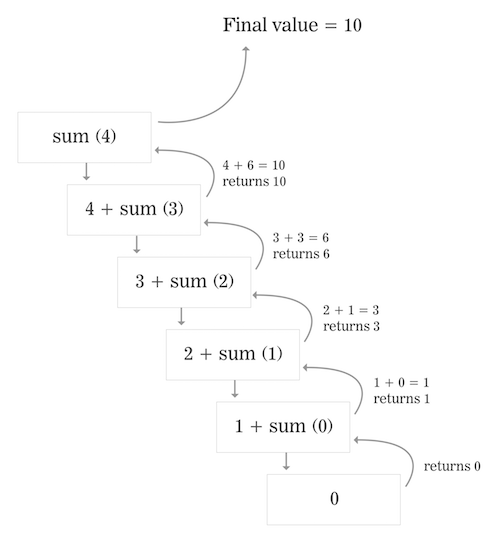

## Codealongs!

Let's look at a few more definitions and try it!

### Base Cases
The base case is the simple case. It's the case when the algorithm doesn't
call itself. These cases are often deceivingly simple! Think of them as
writing what the program should return for the most obvious of examples.

Recursive functions usually follow this pattern. They detect and handle the base
case first, otherwise they perform one small piece of the problem and then
recurse.


If you're writing a function that computes the sum of numbers in a list
the base case is probably:

```js
if (list.length === 0) {
  return 0;
}
```

Because if the list has 0 items in it, the sum of the list will always be 0.

Writing one or more base cases that define the answer for the simplest
part of the problem will prevent your program from calling itself indefinitely.

### Recursive Cases
The recursive case is the case when the function performs one small part
of the problem and calls itself recursively to solve the next small part
of the problem.

## Codealong: Sums

Let's write a function called `sum` that accepts a number `N` and computes the
sum of numbers from 0 to N. `sum(3)` would be `3 + 2 + 1 + 0` and return `6`.

> Follow along in [this JSBin](http://jsbin.com/velerotoci/2/edit?js,console).

First, let's consider the base case. If we're summing a series of numbers, what is the easiest number to sum?


```js
function sum(n) {
  if (n <= 0) {
    return 0;
  }
}
```
> If `n` is 0, then the sum of the numbers would just be 0!

What is the recursive case? Well, it'll have to be for when the numbers are greater than 0. Let's think it out.

```js
function sum(n) {
  if (n <= 0) {
    return 0;
  }
  if (n > 0) {
    // man, I wish we had a function that computed the sum of 0..N-1
    // n + n-1 + n-2 + n-3...
    // maybe "n + n-1 + (n-1)-1 + ((n-1)-1)-1.. down to + 0"...
    // Wait, 'sum' knows to stop at n==0, and that n-1 looks awfully recursive.
  }
}

```

Oh wait!! We've already defined a function that sums all numbers!
Take a step and take the leap of faith. Call the function again!

```js
function sum(n) {
  if (n <= 0) {
    return 0; // base case: stop at n==0!
  } else {
    n + sum(n - 1); // recursive case!
  }
}
```

Wait, this doesn't work. Remember to `return` the value that comes back
from the recursive call.

```js
function sum(n) {
  if (n <= 0) {
    return 0;
  } else {
    return n + sum(n - 1);
  }
}
```

> Did you it out in the JSBin? Does it work?

Let's follow the returns for an input of 4.



## Codealong: Factorials
Let's have a more complicated example - see this in practice by writing a function that computes factorials.

### Factorial definition
A factorial is just all numbers from 1 to N multiplied together.
* For example, `2 factorial` would be all the numbers from 1 to 2 multiplied together - in this case, just `1 * 2`
  * So `2 factorial = 2`.
* `3 factorial` is all the numbers from 1 to 3 multiplied together: `1 * 2 * 3`.
  * So `3 factorial = 6.`

We say "five factorial", but we write "factorial" as "!". So instead of writing "5 factorial", we write `5!`

Here are some examples:

```js
1! = 1 // One factorial (1!) is 1
2! = 2 * 1 = 2 // Two factorial (2!) is 2 times 1 = 2
3! = 3 * 2 * 1 = 6 // Three factorial (3!) is 3 times 2 times 1 = 6
4! = 4 * 3 * 2 * 1 = 24 // Four factorial (4!) is 4 times 3 times 2 times 1 = 24
5! = 5 * 4 * 3 * 2 * 1 = 120 // Five factorial (5!) is 5 times 4 times 3 times 2 times 1 = 120
```
<details>
<summary>How would you calculate `8!`?</summary>

Eight factorial is every number from 1 up to 8 multiplied together. This means `8 * 7 * 6 * 5 * 4 * 3 *2  * 1 = 40,320`

</details>

>  Notice that `5!` is equal to `5` * `4!`.

Check it out:
* `5! = 5 * 4 * 3 * 2 * 1`
* `4! is 4 * 3 * 2 * 1`

Can we replace the `4 * 3 * 2 * 1` in `5! `with `4!`?
 It looks like it, right? If we double check:
  * We know `5! = 120` and `4! = 24`
  * We want to say that `5 * 4!` is the same as `5!`
  * Is `5 * 4! = 120`? Well, `5 * 24 = 120` - so yes!


In English: five factorial is
equal to the number five, multiplied by four factorial. Hmm. That's a
recursive definition, even in English!

```
4! = 4 * 3! = 24
3! = 3 * 2! = 6
2! = 2 * 1! = 2
1! = 1
```

### Codealong: Factorials

How would we program this?

> Follow along with this [JSBin](http://jsbin.com/fisitedifo/2/edit?js,console)

* We start by identifying the base case. The base case here is when `n==1`: because `1!` is always `1`.
* Just in case, we'll include n <=1 as well (in factorials, the factorial of anything <=1 is always 1.)

```js
function factorial(n) {
  // check for the base case.
  if (n <= 1) {
    return 1; // 1! is always 1.
  }
}
```

Great. Now - the recursion! Let's think about if `n==2`. For this, we need to calculate `2*1!`. Well, 1! is our base case - so we just need to return 2 * base case. Possibly, something like this:

```js
function factorial(n) {
  // check for the base case.
  if (n <= 1) {
    return 1; // 1! is always 1.
  } else {
    // call the function again
    return 2 * factorial(1);
  }
}
```

What about three? 4? etc? Let's just make it entirely recursive. Here's how to write a factorial function recursively:

```js
function factorial(n) {
  // check for the base case.
  if (n <= 1) {
    return 1;
  } else {
    // otherwise do a small amount of work and call the function again
    return n * factorial(n - 1);
  }
}
```

Notice that it checks for the easiest answers first and simply returns. If the
function receives any number less than or equal to one it simply returns. This
is the base case.

Look at the else branch. If the function receives input that's higher than 1
then the functional calls itself recursively and passes in a value slightly
smaller `n * factorial(n - 1)`.

If we compute `factorial(2)` the function will hit the else branch, and try to
compute `2 * factorial(2 - 1)`. The function recursively calls itself to get
the answer to `factorial(1)` which we know will turn into just `1`. Therefore
the first function call is really trying to compute `return 2 * 1` after the
recursive call returns `1` as it's value.

Remember the call stack? The call stack refers to how computers keep track
of what functions are being called.


```
function foo() {
   bar();
}

function bar() {
  baz();
}
```

Execute `foo()` here results in a call stack like this diagram. `foo()` is on
the bottom of the stack because it was called first. `foo()` called `bar()` so
it gets stacked on top next. `baz()` was called last and it's currently
executing. As the functions finish executing their pop off the stack one by
one.

```
|       | <- top
| baz() |
| bar() |
| foo() | <- bottom
=========
```


Recursion allows us to write extremely expressive code! We can write a very
small amount of code and have it perform extremely powerful computations.
