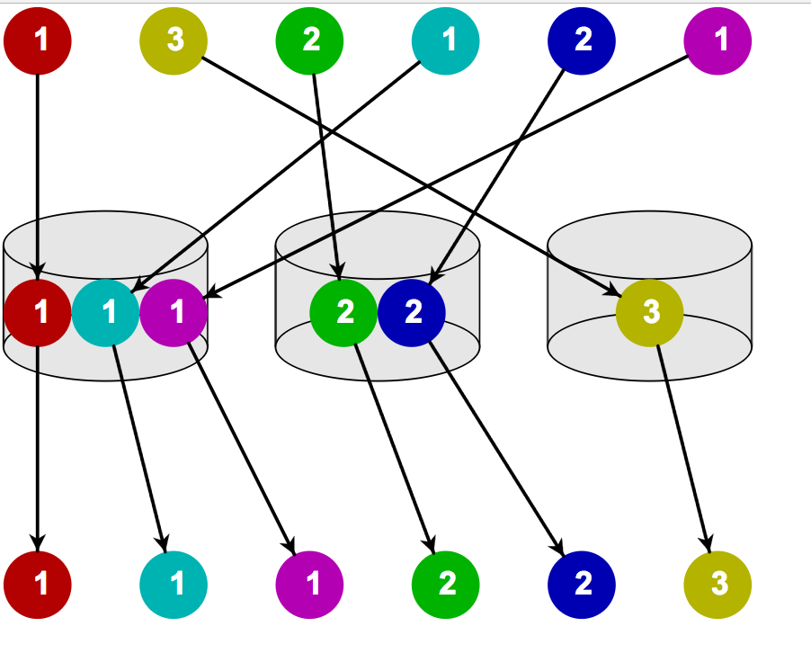

# Bucket Sort

Bucket sort (also known as bin sort) is an array sorting algorithm that works by distributing the elements of an array into groups (or buckets!). Each bucket is then sorted individually - this can be by using a different sorting algorithm or by recursively applying the bucket sorting algorithm (because recursion is great!).

Bucket sort is a very good sorting algorithm specifically if you're dealing
with a dense range of numbers between `0` and some maximum value. Density
means that there are several numbers of each value appearing within the total
range.

* `[1,2,4,5,7,9]` between `1` and `10` is reasonably dense - bucket sort is great.
* `[1, 455, 233, 19901, 2311321]` is not dense at all - bucket sort wouldn't be good here.

The general idea of bucket sort is to go through an array and tally up
how many times each value occurs, then to generate a new array made up
of the values in order with each value appearing the same number of times
it appeared in the original array.


* Image credit: wikimedia

So we:

* Have our initial array: let's say `[2,5,4,12,10,9]`
* Set up an array of initially empty **"buckets"** (1-7, 8-14)
* Go over the original array and **scatter** each object in its bucket (Bucket 1: `[2,5,4]`). Bucket 2: `[12,10,9]`)
* Sort each non-empty bucket.
* Gather: Go through the buckets sequentially and **gather** everything back into the original single array.



* Image credit: wikimedia.org

To keep things easy, we'll allow this implementation of bucket sort to assume
there are no negative numbers in the array.

## Psuedo-code algorithm:
* Create bucketSort function (array, bucket size)
* Create variables to hold the index you're on, min in array, max in array, and bucket size
*  Find min and max value
*  Create some amount of buckets (there are many ways to do this!)
*  Push values to correct buckets
*  Sort buckets


[Try it!](http://jsbin.com/vukalas/1/edit?js,console)
```js
function bucketSort(array) {
  var max = array[0];

  // search for the maximum value
  for (var i = 0; i < array.length; i++) {
    max = Math.max(array[i], max);
  }

   // create an array with indexes from zero to the `max` value.
   var buckets = new Array(max);

   // tally up how many times each value between 0 and max occurs
   for (var i = 0; i < array.length; i++) {
     var value = array[i];

     // make sure there's a proper zero in the tally bucket.
     if (buckets[value] === undefined) {
       buckets[value] = 0;
     }

     // increment the tally for that value
     buckets[value]++;
   }

   var sortedList = [];
   // go over each tally and add the value associated with that tally
   // for as many times as it was tallied.
   for (var i = 0; i < buckets.length; i++) {
     for (var tally = 0; tally < buckets[i]; tally++) {
       sortedList.push(i);
     }
   }
   return sortedList;
}

console.log(bucketSort());
```
