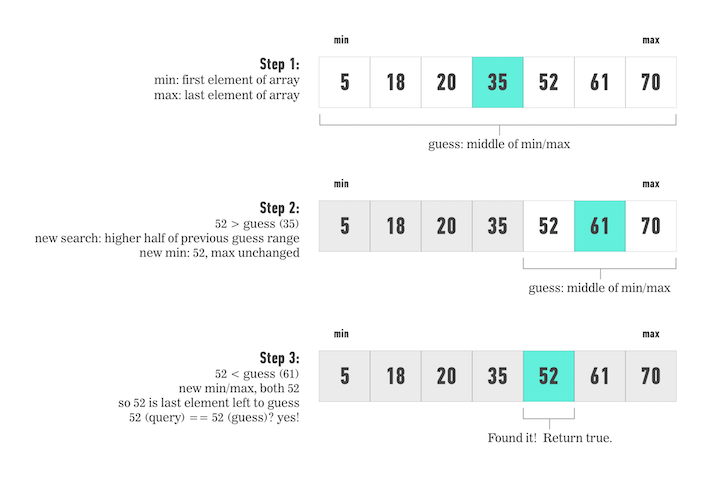

# Searching

Why are we talking about searching?

<iframe src="http://fast.wistia.net/embed/iframe/46lseh301q?seo=false" title="Wistia video player" allowtransparency="true" frameborder="0" scrolling="no" class="wistia_embed" name="wistia_embed" allowfullscreen mozallowfullscreen webkitallowfullscreen oallowfullscreen msallowfullscreen width="640" height="360"></iframe>

# Binary Search
Binary search is a search algorithm used to find the position of a target item in a sorted array.

Binary Search doesn't
work on unsorted arrays or on other data structures that don't have quick index
access like arrays do.

Binary search a **popular** interview question, but it's also a fundamental concept in how efficient searches are performed.

The topic of searching for things in a collection provides room for all sorts of
algorithms in computer science. Let's consider an array of numbers. How can
we write a search algorithm to see if a particular number is in there?

### Brute force...
What would be your first instinct on how to simply, systematically search a sorted array for a specific number?

The "Brute Force" solution is to move one-by-one from the first element to the final element, checking if they are equal.

We could write a `for` loop that looks at every single thing in the array.
That just looks like this:

```js
function getIndex(list, value) {
  for (var i = 0; i < list.length; i++) { // step through array from beginning
    if (list.get(i) === value) { // see if it's the right value
      return i;  
    }
  }

  return -1; // if it's not found, return -1
}
```

The function accepts a `list` (we'll assume an array) and a `value`. It looks at
every single index in the array and returns the value of `i` where that value
exists.

This is called **Linear Search** and is a pretty good algorithm. But! It turns
out that if we can guarantee certain conditions on the list, then we can write
much more efficient algorithms.

> What if we knew the list were sorted?

If we were looking for a word in an alphabetized dictionary, would we start at the beginning and look at every word?

Instead of reading every single word, it's much easier to read one random word
and flip far forward or backward depending on how close that name is to the word
you're looking for.

This only works because the dictionary is sorted alphabetical. Binary search works exactly the same way on anything sorted.


## Auto Guess

Binary Search finds items quickly by:
* Comparing the target value to the value of the middle element of the sorted array.
* If the target value is equal to the middle element's value, then the position is returned and the search is finished.
* If the target value is less than the middle element's value, then the search repeats on the lower half of the array (excluding middle element;) or if the target value is greater than the middle element's value, then the search repeats on the upper half of the array.
* This process continues, eliminating half of the elements, and comparing the target value to the value of the middle element of the remaining elements - until the target value is either found (and its associated element position is returned), or until the entire array has been searched (and "not found" is returned).

Let's follow a binary search on a sorted array, looking for `52`:


### How Fast is Fast?

Imagine we had an array where every array access took 1 second. No matter what index
we read it would take a full second for us to get the value. It would take us a minute
to read every item in an item with only 60 items in it.

How long is a trillion seconds?

* 1,000 seconds is equal to almost 17 minutes.
* It would take almost 12 days for a million seconds to elapse
* It takes about 31.7 years for a billion seconds to go by.
* A trillion seconds amounts to no less than 31,709.8 years.

It would take practically 31,709 years to search iteratively through an array with one trillion items.

With binary search it would take only 40 guesses to find the correct index.
Binary Search reduced the runtime of searching for something in the trillion-length array from 31,709 years to only 40 seconds!

Binary Search is extremely fast.
