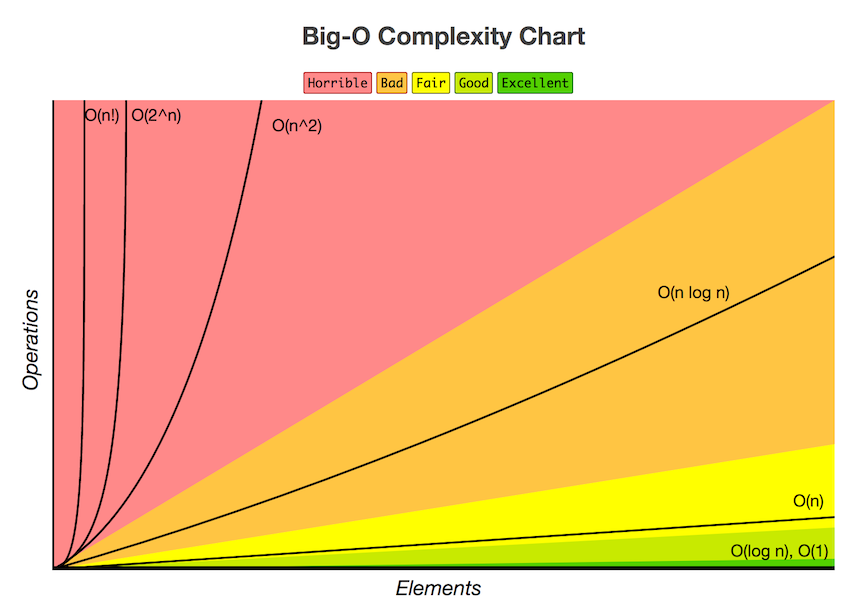

## A break: How to remember all this?

An easy way to keep track of Big-O notation is just to remember: The smaller the value inside the O(), the better. O(log(N)) is better than O(N), which is better than O(N2), which is better than O(N5). Etc.

## Comparison

Check out this table of running algorithms on different input sizes versus the complexity (Big-O notation), and the time it takes to run the algorithm.

##### Common notations

|Input Size (n)|O(1) | O(log(N))  | O(Nlog(N)) | O(N)   | O(N2) |
|--------------|-----| ---------- | -----------| ------ |---------------------------|
| **1**            |1    | 1          | 1          | 1      | 1                         |
| **10**          |1    | 3          | 30         | 10     | **100**                       |
| **40**           |1    | 5          | 50         | 40     | 1600                      |
| **80**           |1    | 6          | 60         | 80     | 6400                      |
| **600**          |1    | 9          | 90         | 600    | 360000                    |
| **10,000**       |1    | 13         | 130        | 10,000 | 100,000,000               |

Put into chart form, we have:

Observe how curves for different complexities compare to each other.

* O(1) is a totally flat line. It's constant no matter how much
  data is given to it.
* O(log(n)) goes up, then flattens out.
* O(n) goes up and right in a straight line.
* O(n2) starts to spike up sharply as data gets large.

See how all of these curves look compared to each other on this image and at
[Big-O Cheatsheet](http://bigocheatsheet.com/).
