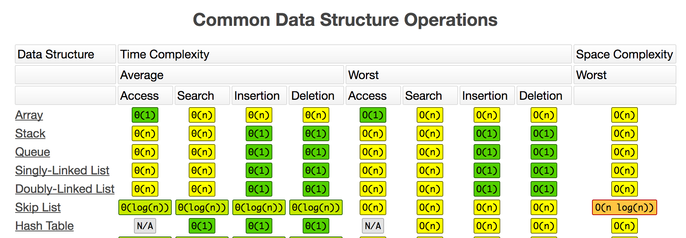
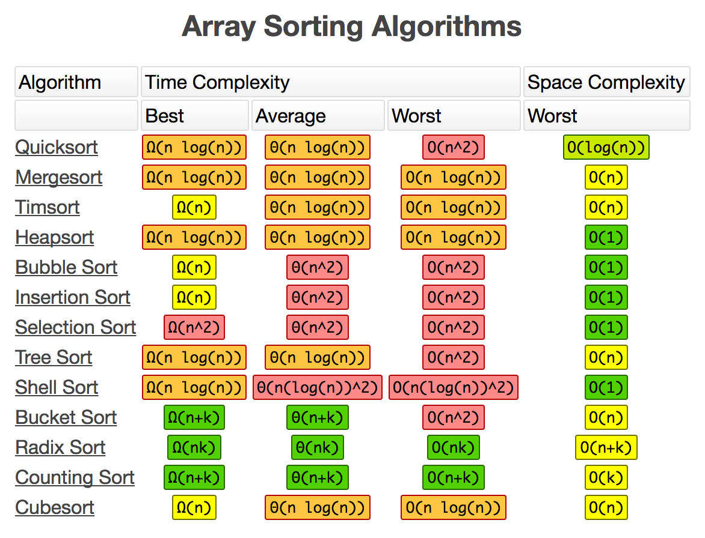

# Common Complexities
See the [Cheat Sheet](http://bigocheatsheet.com/) for some common time
(processing time) and space (memory) complexities and their notations.

Notice that the charts on the cheat sheet include several other measures
alongside our Big-O notation. The Big-O `O()` notation we use means "worst case"
complexity. The charts also show notations for "best case" and "average case".
It's good to know the best case, and average case for algorithms too. Big-O
worst case complexity is what programmers usually talk about the most.

The charts also mention **Space Complexity**, especially for the sorting
algorithms. Space complexity refers to how much memory in the computer an
algorithm takes up. We can use Big-O notation to measure **Time** and **Space**
complexity. How long does an algorithm take to run, and how much memory will
it take up while it's running.

Insertion sort has a Time complexity of `O(N<sup>2</sup>)` because it has two
nested for loops. The first for loop goes over the `N` indexes and the second
for loop reads every item in the array to find the smallest element to be placed
into that index. `N * N`.

Insertion sort has a Space complexity of `O(1)` because it only creates a few
local variables. It has `i` and `j` to keep track of the array indexes it's
looking at in each for loop. It has `minIndex` and `minValue` variables to keep
track of where it's seen the lowest value as it goes through the array over
and over. No matter how big of an array Insertion sort is given it always uses
a constant `O(1)` amount of memory.

[Try Insertion Sort](http://jsbin.com/hakowex/1/edit?js,console)

Bucket Sort has a fast `O(N)` time complexity. It uses one for loop to go
through the array and tally up every value it sees. It uses a second for loop
to iterate through the list of tallies and add the value to an array as many
time as it was tallied.

Unlike Insertion Sort, which has an `O(1)` space complexity, Bucket Sort has
an `O(N)` space complexity. Bucket Sort depends on creating a second array
that's as big as the original array. The larger the array, the more memory
the algorithm will take up.

If something is bound by time then it may just take a very long time to run.
If something is bound by memory then it's possible that a computer might not
have enough memory to complete the whole algorithm! Back in the day people
thought computers couldn't play Chess because there were too many moves to
think about. The problem was bounded by memory. Now computers have more than
enough memory to consider every possible move, and several moves ahead. Now,
other games like [Go](https://en.wikipedia.org/wiki/Go_(game)) are challenging
programmers to come up with better algorithms to create AIs. There are many
more possible moves in Go than in Chess. Still, programmers at Google have
only just recently created an AI called AlphaGo that beat the top human Go
player, Lee Sodal.

Notice that there's nested for loops in the Bucket Sort code. Nested for loops
aren't always `O(N<sup>2</sup>)`! The nested for loop here doesn't iterate
over the entire array. It only goes up to the number of the tally.

[Try Bucket Sort](http://jsbin.com/vukalas/1/edit?js,console)
```js
// go over each tally and add the value associated with that tally
// for as many times as it was tallied.
for (var i = 0; i < buckets.length; i++) {
  for (var tally = 0; tally < buckets[i]; tally++) {
    sortedList.push(i);
  }
}
```




